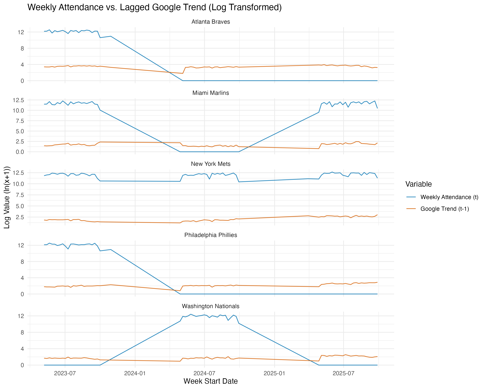
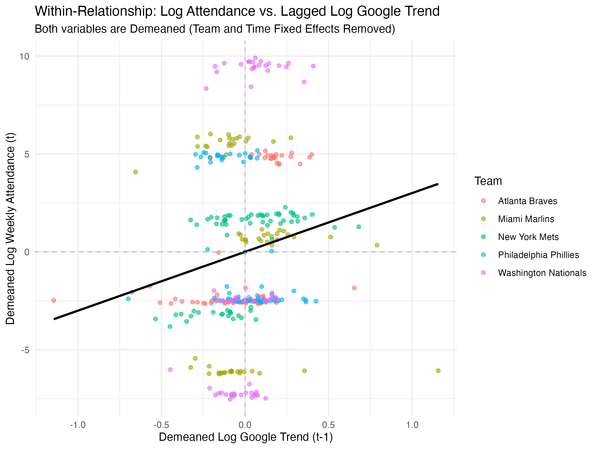

# mlb-attendance-digital-engagement
Does online fan engagement predict MLB stadium attendance? A panel-data analysis using Google Trends.
# 📊 Digital Attention and MLB Attendance

**Author:** Dasol Shin  
**Program:** B.S. Computational & Data Sciences, George Mason University  
**Focus:** Sports Analytics · Data Science · Econometrics

---

## 🔍 Project Overview

This project investigates whether **online fan engagement**, measured using **Google Trends search activity**, can serve as a **leading indicator of Major League Baseball (MLB) stadium attendance**.

While traditional attendance models emphasize team performance and market characteristics, modern fans increasingly engage with teams digitally. This project asks whether digital attention translates into real-world attendance behavior.

---

## ❓ Research Question

> Can online fan engagement predict next-week MLB stadium attendance?

**Initial Hypothesis:**  
Increases in Google search activity for a team will be followed by higher attendance in the subsequent week.

---

## 📦 Data Sources

- **MLB Attendance & Game Results:**  
  Baseball-Reference
- **Online Fan Engagement:**  
  Google Trends (daily search indices, aggregated weekly)

**Sample:**  
National League East teams, 2023–2025 regular seasons  
**Unit of Analysis:**  
Team–week panel

---

## 🧪 Methodology

- Constructed a **weekly team-level panel dataset**
- Applied a **one-week lag** to online search activity
- Estimated a **log-linear two-way fixed effects regression**:

\[
\ln(Attendance_{i,t}) =
\beta_1 \ln(Trend_{i,t-1}) +
\beta_2 WinRate_{i,t-1} +
\beta_3 HomeGames_{i,t} +
\alpha_i + \gamma_t + \varepsilon_{i,t}
\]

- Team fixed effects control for market size and stadium capacity  
- Week fixed effects control for seasonality and league-wide shocks  

---

## 📈 Key Results

- **Lagged Google Trends coefficient:**  
  **−1.60 (p = 0.00027)** → statistically significant and negative
- **Win rate:**  
  Strong positive predictor of attendance
- **Home games per week:**  
  Not statistically significant after fixed effects

📌 **Conclusion:**  
Online search spikes do *not* predict higher attendance.  
Instead, they often reflect news-driven curiosity (injuries, trades, controversies) rather than intent to attend games.

---

## 📊 Visualizations

### Weekly Attendance vs. Lagged Google Trends

### Fixed Effects Relationship (Within-Team)

---

## 📁 Repository Structure

mlb-attendance-digital-engagement/
├── README.md            # Project overview, research question, and key results
├── code/                # R scripts for data cleaning, panel construction, and regression modeling
│   └── capstone.R
├── figures/             
│   ├── attendance_trend_timeseries.png
│   ├── demeaned_scatter_plot.png
│   └── distribution of weekly home games.png
├── paper/               # Written deliverables
│   ├── capstone_project_paper.pdf
│   └── science_article.pdf
│   └── capstone_proposal.pdf
│   └── capstone_slide.pdf

